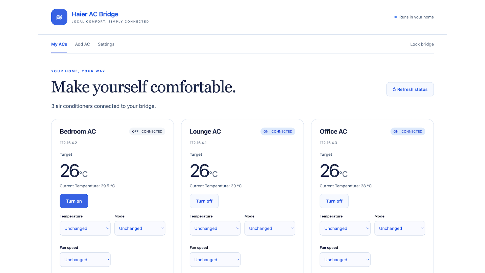

# Haier AC Bridge

Control compatible **Haier Haismart air conditioners on your home network** from a simple browser interface, with an API for automations.

Clone the repo, run the bridge, and connect your first AC in the browser.



## Why I built this

I wanted my Haier ACs to be part of the home I was already managing in Home Assistant. Haier/Haismart didn't offer an official Home Assistant integration for my setup, so I kept switching between Haismart for the ACs and another app for everything else.

I didn't want the app that came with an appliance to decide how I could use it. So I built this bridge to give myself a way to control the ACs locally and connect them to my own automations. I'm sharing it so others with the same problem can use it too.

## Try it from the CLI

Install **[Node.js 22 or 24](https://nodejs.org/en/download)** and **[Git](https://git-scm.com/downloads)** if you don't already have them. With Node.js installed, set up the package manager once:

```sh
npm install --global pnpm@10.34.1
```

Connect your computer to the same home network as your AC, then run:

```sh
git clone https://github.com/zishanneno/haier-ac-bridge.git
cd haier-ac-bridge
pnpm install --frozen-lockfile
pnpm dev
```

Open **[localhost:8787](http://localhost:8787)** and enter the **Bridge access code** printed in the terminal. Keep that terminal open while using the bridge. That's all you need to start—no Docker, separate database installation, or configuration file.

### Connect your first AC

Your AC should already be paired in the **Haismart** app.

1. Click **Add my first AC**.
2. Sign in with your Haismart email/phone and password. Enter your account's country calling code, such as `92` for Pakistan, without the `+`.
3. Choose your AC, give it a name, and click **Add this AC**. If its IP address isn't found automatically, enter it from your router's connected-device list.
4. Try **Turn on/off**, or choose a temperature and click **Apply changes**.

You can also use **Add by IP or local key** if you already have a local key. Apple-only sign-in needs a Haismart account password.

**Will it work with my AC?** This early release supports compatible Haismart ACs using the Southeast Asia service. Support varies by model and firmware; hOn and SmartAir2 aren't supported. See [compatibility](docs/COMPATIBILITY.md).

### Prefer a double-click launcher?

After installing Node.js and pnpm as above, double-click **`Start-mac.command`** on macOS or **`Start-windows.cmd`** on Windows in the source folder. It installs dependencies, starts the bridge, and opens your browser. Keep the full source folder together.

If a downloaded launcher won't open, use the CLI commands above. More help is in [troubleshooting](docs/TROUBLESHOOTING.md#desktop-launchers).

## Everyday use

- Control power, temperature, mode, fan, swing, Quiet, and Eco from your browser.
- Click **Refresh status** after using the physical remote or another app.
- Press **Ctrl+C** to stop. Run `pnpm dev` in the same folder—or open the launcher—to start again. Your setup is saved.
- Set optional power-on preferences in **Settings**; otherwise, turning on an AC keeps its previous settings.

Normal reads and controls go directly to the AC on your home network. Haismart is used for account setup and local-key retrieval or refresh. Your submitted Haismart password isn't saved, and there's no bridge account or subscription.

See [Using your bridge](docs/USAGE.md) for phone access, changing ports, backups, updates, and API examples. Keep the bridge on your trusted home network; see [security](SECURITY.md) before exposing it elsewhere.

## Home Assistant and Docker

The API lets you connect the bridge to Home Assistant and other automations. This repository doesn't yet include a ready-made Home Assistant integration or add-on; see [automation setup](docs/USAGE.md#connect-automations-and-home-assistant).

When you're ready to leave it running on a server or NAS, follow the optional [Docker deployment guide](docs/DOCKER.md). You can try everything from the CLI first.

## Help and contributing

Having trouble? Start with [troubleshooting](docs/TROUBLESHOOTING.md) or [open an issue](https://github.com/zishanneno/haier-ac-bridge/issues). Include your bridge version, AC model, region, and the error you saw. Remove passwords, access codes, tokens, and local keys before sharing logs.

Want to help? See [CONTRIBUTING.md](CONTRIBUTING.md). Maintainers can use the [release guide](docs/RELEASING.md).

Independent community project, not affiliated with Haier. Licensed under [MIT](LICENSE), with [third-party attribution](THIRD_PARTY_NOTICES.md).
